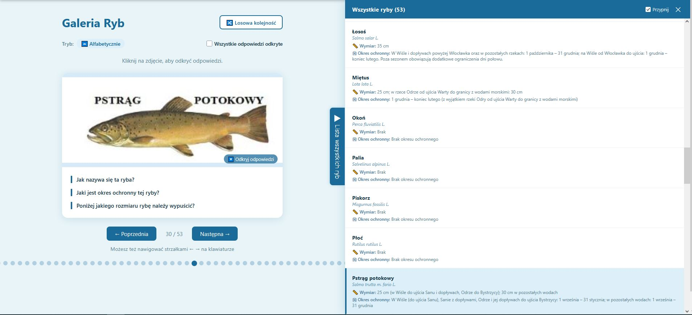

# Polish Fishing Exam App

A study aid for candidates preparing for the Polish fishing licence exam (karta wędkarska).



## Getting Started

### Requirements

- [Node.js](https://nodejs.org/) (v18 or higher)

### Install dependencies

```bash
npm install
```

### Development server

```bash
npm run dev
```

App available at **http://localhost:5173**.  
Changes hot-reload automatically (HMR).

### Stop the server

Press `Ctrl+C` in the terminal running `npm run dev`.

## Available commands

| Command | Description |
|---|---|
| `npm run dev` | Start the development server (localhost:5173) |
| `npm run build` | Build for production into the `dist/` folder |
| `npm run preview` | Preview the production build locally |

## Deployment

To deploy to a static host:

1. Build the app: `npm run build`
2. Upload the contents of `dist/` to any static hosting provider (e.g. GitHub Pages, Netlify, Vercel)
